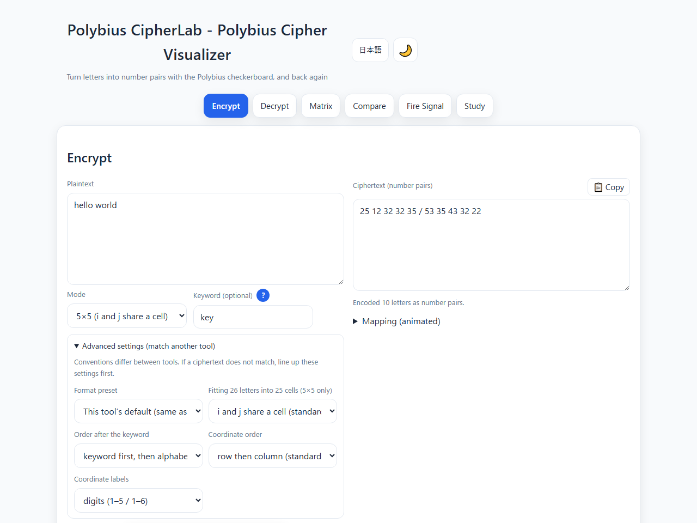
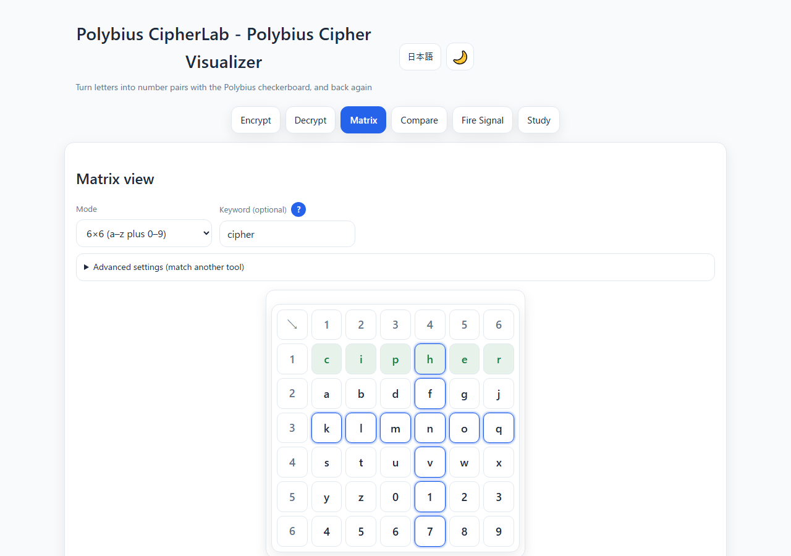
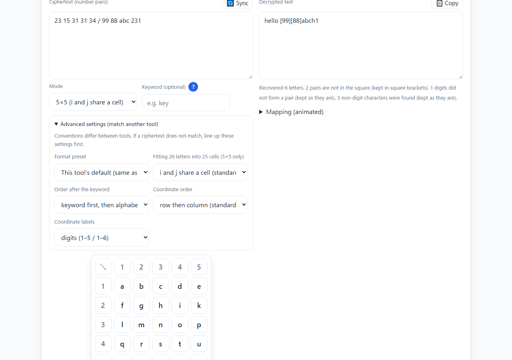
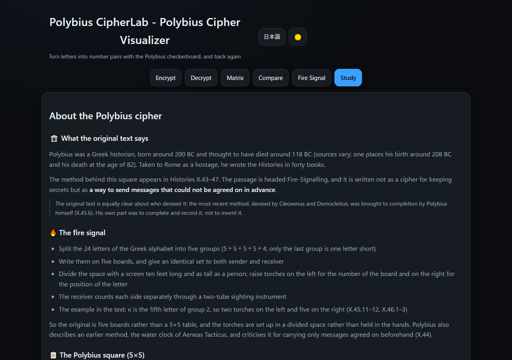
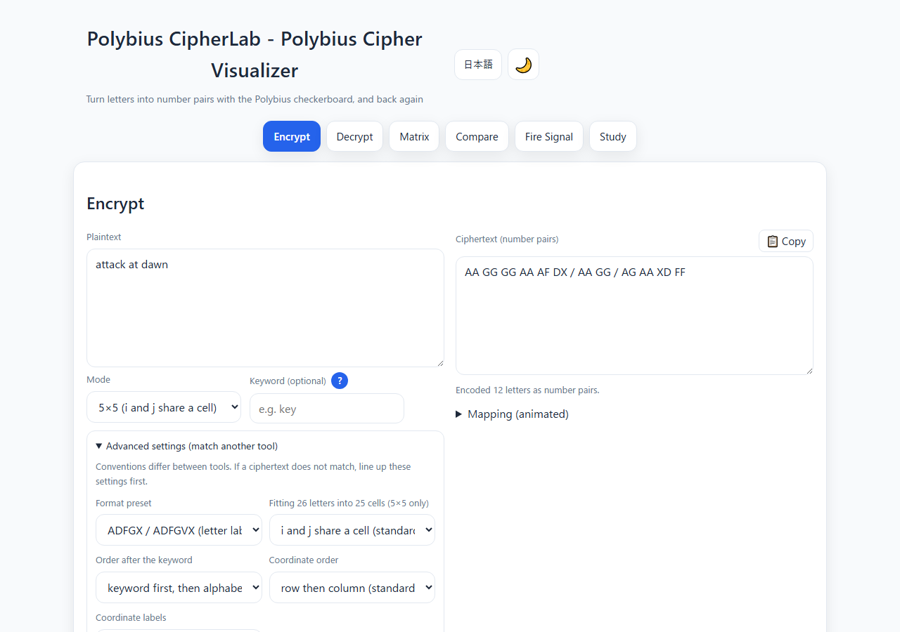
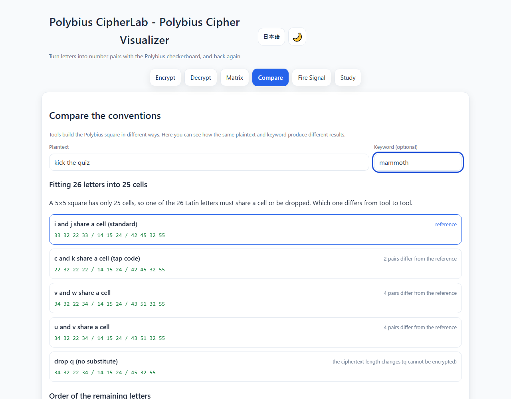
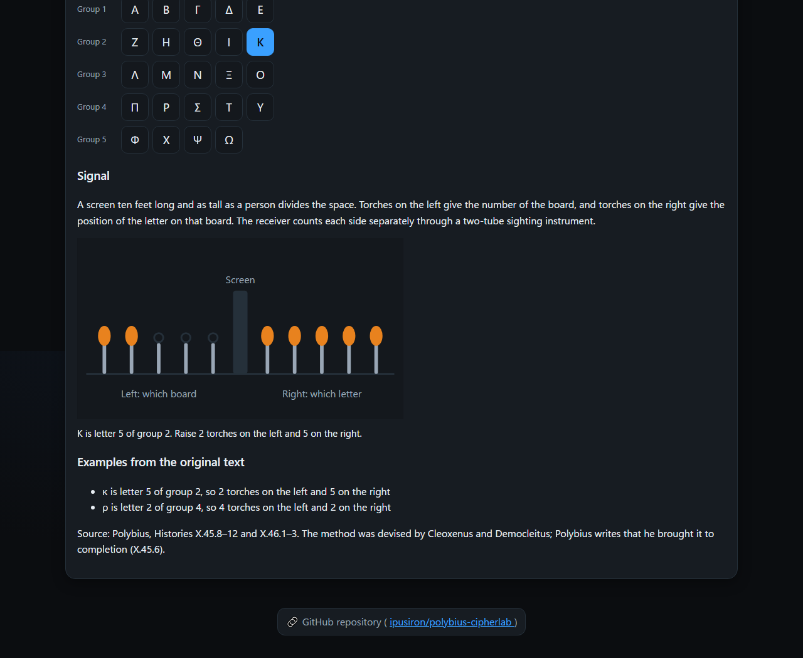

English · [日本語](README.md)

# Polybius CipherLab - Polybius Cipher Tool


[](https://ipusiron.github.io/polybius-cipherlab/)

**Day067 - 100 Security Tools with Generative AI**

**Polybius CipherLab** is a web app for learning the Polybius cipher, the classical cipher that replaces each letter with a pair of numbers.

Build the square from a keyword and follow the mapping letter by letter. Input that cannot be read is never silently dropped: it stays on screen, and the counts are reported.

---

## 🌐 Demo

👉 **[https://ipusiron.github.io/polybius-cipherlab/](https://ipusiron.github.io/polybius-cipherlab/)**

Runs entirely in your browser.

---

## 📸 Screenshots

>
>*Encrypting "hello world" with the keyword key*

>
>*The 6×6 square, with the keyword letters highlighted*

>
>*Decryption keeps what it could not read and reports the counts*

>
>*The Study tab explains the original text with sources (dark mode)*

>
>*Advanced settings matched to the ADFGX format, so the coordinates become letters*

>
>*The Compare tab encrypts the same plaintext under five conventions and counts the differences*

>
>*The Fire Signal tab: κ is letter 5 of group 2, so 2 torches on the left and 5 on the right (dark mode)*

---

## ✨ Features

- Encryption: turn plaintext into number pairs using the square
- Decryption: turn a sequence of number pairs back into letters
- Live square: the table is redrawn as the mode and keyword change, with the keyword letters highlighted
- Cell highlight: press a cell to light up its row and column
- Sync: move the ciphertext and the settings from the Encrypt tab to the Decrypt tab in one click
- Mapping list: every letter in order, with unreadable items shown in a different colour
- Two modes: 5×5 (i and j share a cell) and 6×6 (a–z plus 0–9)
- Match other tools: choose how 26 letters fit into 25 cells, how the rest of the alphabet follows the keyword, the coordinate labels and the coordinate order
- Presets: the default shared with dCode and cryptii, Crypto Corner (column then row), ADFGX / ADFGVX, and tap code (c and k share a cell)
- Ambiguity made visible: when decryption yields a letter that could be read two ways (i or j), both appear in the mapping and the count is reported
- Compare: encrypt the same plaintext under five conventions, and see five keyword orders as squares
- The original fire signal: replay the method from the original text, splitting the 24 Greek letters into five groups and raising torches on each side of a screen
- Themes: light and dark (the first choice follows your browser)
- Japanese and English interface

---

## 📖 How to use

1. Type the plaintext in the Encrypt tab
2. Choose the mode (5×5 or 6×6)
3. Add a keyword if you want one (it changes the order of the square; the other side needs the same keyword)
4. Press Encrypt
5. Press Sync to carry the ciphertext and settings to the Decrypt tab, then press Decrypt to confirm the round trip

### Three options

| Option | On | Off |
|---|---|---|
| Keep word breaks | spaces, newlines and tabs become `/` | spaces, newlines and tabs are removed |
| Join the number pairs | `2315313134` runs together | `23 15 31 31 34` is separated by spaces |
| Keep punctuation and digits | punctuation outside the square stays in the ciphertext | punctuation outside the square is removed |

With "Keep punctuation and digits" on, a space is always inserted on each side of a symbol. Without it, `a1b` would come out as `11112` and the pair boundaries would be lost. Characters outside the alphabet (Japanese, for example) are never written to the ciphertext, even with this option on.

### Advanced settings (match another tool)

Conventions for the Polybius cipher differ between tools. If your ciphertext does not match another tool, open the advanced settings and line them up.

| Setting | Choices | Default |
|---|---|---|
| Fitting 26 letters into 25 cells | i and j / c and k / v and w / u and v / drop q | i and j |
| Order after the keyword | keyword first then alphabetical / keep the last occurrence / reverse the keyword / reverse the rest / keyword at the end | keyword first then alphabetical |
| Coordinate labels | digits (1–5, 1–6) / letters (ADFGX, ADFGVX) / custom | digits |
| Coordinate order | row then column / column then row | row then column |

A preset switches all four at once.

- **This tool's default**: the same as dCode, cryptii and Boxentriq
- **Crypto Corner**: the coordinate order is column then row
- **ADFGX / ADFGVX**: the coordinate labels are letters
- **Tap code**: c and k share a cell (the convention used by prisoners of war in Vietnam)

The Sync button carries these settings across as well.

---

## 📐 Screens

| Tab | Contents |
|---|---|
| Encrypt | plaintext, mode and keyword, three options, ciphertext, mapping list |
| Decrypt | ciphertext, sync button, mode and keyword, decrypted text, mapping list |
| Matrix | the square at full size; press a cell to light up its row and column |
| Compare | five ways of fitting 26 letters into 25 cells, and five orders after the keyword |
| Fire Signal | the method of the original text; pick a letter to see how many torches to raise |
| Study | the original text, the 5×5 square, what kind of cipher it is, and ciphers built on it |

The three working tabs hold **their own settings**. Changing the keyword in the Encrypt tab does not change the square in the Decrypt tab. Use the Sync button to carry settings across.

---

## 🎯 Use cases

### Ways of using this tool in particular

- Confirming the coordinate idea of addressing by row and column (mathematics and spreadsheet classes): the square represents a letter as a pair of "row digit, column digit". Encrypting HELLO with the standard 5x5 square gives 23 15 31 31 34, and every digit stays within 1 to 5. It is the same way of pointing as a spreadsheet address like A1, a map grid, or the coordinates of a chess or Go board. You can also see that one letter becomes two digits, so the length doubles
- Confirming that a two-digit base-5 number was once a count of torches (history and numeral-system classes): the Polybius square was originally a way to send one letter over a distance by the counts of torches on the left and right (each 1 to 5). In the "torch signal" tab, for the Greek word ΝΙΚΗ (victory) Ν is 3 and 3, Ι is 2 and 4, Κ is 2 and 5, and Η is 2 and 2. It is an old example of base-5 place value, lining up two of five states to represent 5x5 = 25
- Confirming that enlarging the square also fits digits (encoding design): switching to 6x6 fits 36 cells, the 26 letters plus 10 digits, and each digit uses 1 to 6. HELLO2026 becomes 22 15 26 26 33 55 53 55 63. You can see the design choice in fixed-length encoding between enlarging the table to fit more kinds of character in one cell and keeping the range of each digit small

### Learning security

- Meet classical ciphers through a method you can work by hand, where position stands for a letter
- Watch the mapping list to see that the same letter always produces the same pair, and understand why a monoalphabetic cipher falls to frequency analysis
- In a CTF or a puzzle hunt, test whether a string of digits reads as a Polybius square

### Teaching and self-study

- Use it in a computing class as an example of encoding, that is, representing letters as numbers
- Use it in a history class to show ancient Greek signalling. The Fire Signal tab replays the five boards and the torches on each side as the original text describes them
- Use it in a maths class as a concrete example of coordinates, where a pair of numbers points to a position

### Work

- Check your own implementation of the cipher against this one to find mistakes
- When results do not match another tool, use the Compare tab to find out which convention differs
- Explain the principle on a single screen in training material

### Hobby and creative work

- Build puzzles for an escape room or a puzzle hunt, and check the answers
- Confirm that a cipher used in a novel or a game actually works
- Exchange ciphertexts with children using nothing but paper and pencil
- In electronics, assign letters to counts on two LEDs or buzzers (the same idea as the torches of the original text)

### With other tools

- [Playfair CipherLab](https://ipusiron.github.io/playfair-cipherlab/): compare with another cipher that uses a 5×5 square
- [Uesugi Cipher Tool](https://ipusiron.github.io/uesugi-cipher/): compare with the Japanese 7×7 square
- [Frequency Analyzer](https://ipusiron.github.io/frequency-analyzer/): measure the letter frequencies of the decrypted text

### Limits

- This is a learning tool. **It cannot keep anything secret.** The cipher is monoalphabetic, so letter frequencies give it away without the key
- In 5×5, i and j cannot be told apart. Use the context to decide which one a decryption means
- The input limit is 10,000 characters; anything beyond is cut, and the count is reported

---

## 🔬 How it works

### Building the square

1. Take the usable letters of the keyword in order (in 5×5, j is read as i, and digits and punctuation are dropped)
2. Skip a letter that has already appeared
3. Fill the remaining 25 (or 36) cells with the rest of the alphabet
4. The pair for a cell is its row label followed by its column label

Changing the order setting changes steps 2 and 3. With the default settings, the keyword `key` gives this 5×5 square.

```
  1 2 3 4 5
1 k e y a b
2 c d f g h
3 i l m n o
4 p q r s t
5 u v w x z
```

### Reading a ciphertext

The input is split on whitespace, `/` marks a word boundary, and the label characters are read two at a time. Whatever cannot be read is **kept rather than dropped**.

| Input | Treatment | On screen |
|---|---|---|
| a pair outside the square (`99` in 5×5) | kept in square brackets | the count is reported |
| a digit left over without a partner | kept as it is | the count is reported |
| a character that is not a label | kept as it is | the count is reported |

Because of this, a ciphertext that kept its punctuation round-trips: `a1b` → `11 1 12` → `a1b`.

### The fire signal of the original text

What Polybius describes in Book X of the Histories is not a 5×5 square.

1. Split the 24 letters of the Greek alphabet into five groups (5＋5＋5＋5＋4; only the last group is one letter short)
2. Write them on five boards, and give an identical set to both sender and receiver
3. Divide the space with a screen ten feet long and as tall as a person
4. Raise torches on the left for the number of the board, and on the right for the position of the letter on that board
5. The receiver counts each side separately through a two-tube sighting instrument

The original text gives κ and ρ as examples. κ is letter 5 of group 2, so two torches on the left and five on the right; ρ is letter 2 of group 4, so four on the left and two on the right. The tests recompute these numbers and check them against the text on screen.

### A separate calculation layer

Building the square, encrypting and decrypting live in `js/polybius-core.js`, which never touches the DOM. The interface layer (`script.js`) only reads input and shows results. The tests call the calculation layer directly.

---

## 🔒 Security

- Everything runs in your browser. Nothing you type is sent anywhere
- No external CDN, library or analytics is loaded
- A Content Security Policy is set in a `<meta>` tag (`default-src 'self'`)
- Output is written with `textContent` and element construction, never `innerHTML`
- The only thing kept in `localStorage` is your theme and language choice, never your text

---

## ⚠️ Note

This tool is for learning and for checking your own work. A ciphertext produced here keeps nothing secret. When something really must stay secret, use modern cryptography such as AES or public-key cryptography.

---

## ❓ FAQ

**Q. In 5×5, my j turns into i.**

A. A 5×5 square has only 25 cells, so one of the 26 Latin letters has to share a cell with another. This tool follows the convention of merging i and j. If you need j in a cell of its own, use 6×6 mode.

**Q. My ciphertext does not match another tool.**

A. Usually a difference in convention: (1) how 26 letters fit into 25 cells (i and j, c and k, v and w, dropping q), (2) the coordinate order (row then column, or column then row), (3) the order of the letters after the keyword, (4) the coordinate labels. **The advanced settings cover all four.** A preset will line the tool up with Crypto Corner (column then row) or ADFGX (letter labels) in one step.

**Q. My decryption shows something like `[99]`.**

A. That pair is outside the square. Either the mode or the keyword differs from the one used for encryption, or the ciphertext is damaged. It is kept rather than dropped, so you can see where things diverge.

**Q. Can I encrypt Japanese?**

A. No. The square holds Latin letters (and digits in 6×6 mode), so other characters are removed and the count is reported. They never appear in the ciphertext, even with "Keep punctuation and digits" on.

**Q. Can I make a tap code?**

A. Choose the Tap code preset: c and k then share a cell. That is the convention used by American prisoners of war in Vietnam, not the i-and-j merge. The number of taps is the row and then the column.

**Q. Is the order of the digits in 6×6 fixed?**

A. This tool packs `a`–`z` and then `0`–`9` row by row. Every other tool surveyed uses the same order.

---

## 🔗 References

### Original and primary sources

- Polybius, *The Histories*, Book X, 43–47 (the fire signal; the method was devised by Cleoxenus and Democleitus, and Polybius writes that he brought it to completion)
- Aeneas Tacticus, *How to Survive under Siege*, XXXI (the earlier water-clock method)
- W. F. Friedman, *Military Cryptanalysis, Part I* (treatment as a monoalphabetic cipher, frequency distribution) and *Part IV* (the definition of fractionating, ADFGX)
- P. Hitt, *Manual for the Solution of Military Ciphers* (1916); A. Langie, *Cryptography* (1922)

### Related tools

- [Playfair CipherLab](https://ipusiron.github.io/playfair-cipherlab/) (Day027)
- [Uesugi Cipher Tool](https://ipusiron.github.io/uesugi-cipher/) (Day012)
- [Frequency Analyzer](https://ipusiron.github.io/frequency-analyzer/) (Day009)
- [Porta CipherLab](https://ipusiron.github.io/porta-cipherlab/) (Day080)

---

## 🧪 Tests

```bash
npm test
```

- Requires Node.js 22 or later. There are no dependencies (only `node --test`)
- GitHub Actions runs them on every push and pull request
- They cover round trips, known answers, boundaries and invalid input in the calculation layer, static checks on index.html, contrast ratios, the Japanese and English dictionaries, and the tables and examples in both READMEs
- The squares and conversions printed in this README are recomputed by the tests and checked against the code

---

## 📁 Directory structure

```
polybius-cipherlab/
├── index.html              # the page (six tabs, help buttons, theme and language switches)
├── script.js               # interface layer (reading input, showing results, tabs, theme)
├── style.css               # colours and layout (light and dark, narrow screens)
├── js/                     # scripts
│   ├── polybius-core.js    # calculation layer (building the square, encryption, decryption; no DOM)
│   ├── messages.js         # all interface text in Japanese and English
│   └── i18n.js             # choosing the language and replacing the text on the page
├── test/                   # tests (run with node --test)
│   ├── load.js             # loads the browser scripts, plus reference implementations
│   ├── core.test.js        # calculation layer (round trips, known answers, boundaries, invalid input)
│   ├── options.test.js     # settings (merge conventions, keyword order, labels, coordinate order)
│   ├── signal.test.js      # the fire signal (the five groups, the numbers in the original text)
│   ├── i18n.test.js        # the two dictionaries (matching keys, matching placeholders, language choice)
│   ├── html.test.js        # static checks on index.html (CSP, ids, aria, external references)
│   ├── contrast.test.js    # contrast ratios (4.5:1 or better in both themes)
│   ├── format.test.js      # guards against minified files and DOM use in the calculation layer
│   └── readme.test.js      # recomputes the tables and examples in both READMEs
├── .github/                # GitHub settings
│   └── workflows/          # GitHub Actions workflows
│       └── test.yml        # runs npm test on push and pull request
├── assets/                 # images
│   ├── favicon.svg         # the icon shown on the browser tab
│   ├── screenshot.png      # screenshot (Encrypt tab)
│   ├── screenshot2.png     # screenshot (Matrix tab)
│   ├── screenshot3.png     # screenshot (Decrypt tab)
│   ├── screenshot4.png     # screenshot (Study tab, dark mode)
│   ├── screenshot5.png     # screenshot (advanced settings, ADFGX)
│   ├── screenshot6.png     # screenshot (Compare tab)
│   ├── screenshot7.png     # screenshot (Fire Signal tab)
│   └── en/                 # screenshots of the English interface
│       ├── screenshot.png  # screenshot (Encrypt tab)
│       ├── screenshot2.png # screenshot (Matrix tab)
│       ├── screenshot3.png # screenshot (Decrypt tab)
│       ├── screenshot4.png # screenshot (Study tab, dark mode)
│       ├── screenshot5.png # screenshot (advanced settings, ADFGX)
│       ├── screenshot6.png # screenshot (Compare tab)
│       └── screenshot7.png # screenshot (Fire Signal tab)
├── package.json            # test settings (no dependencies)
├── CLAUDE.md               # notes for Claude Code
├── LICENSE                 # MIT License
├── .gitignore              # Git exclusions
├── .nojekyll               # tells GitHub Pages not to run Jekyll
├── README.md               # Japanese README
└── README.en.md            # this file
```

---

## 💻 Requirements

- A modern browser (the current version of Chrome, Edge, Firefox or Safari)
- To run it locally, open `index.html` directly; every file it loads sits in the same folder
- To run the tests, Node.js 22 or later

---

## 📄 License

MIT License – see [LICENSE](LICENSE) for details.

---

## 🛠️ About this tool

This tool was built as part of **100 Security Tools with Generative AI**, a project that creates and publishes a security-related tool every day for 100 days with the help of generative AI.

For the project and the other tools, see:

🔗 [https://akademeia.info/?page_id=42163](https://akademeia.info/?page_id=42163)
