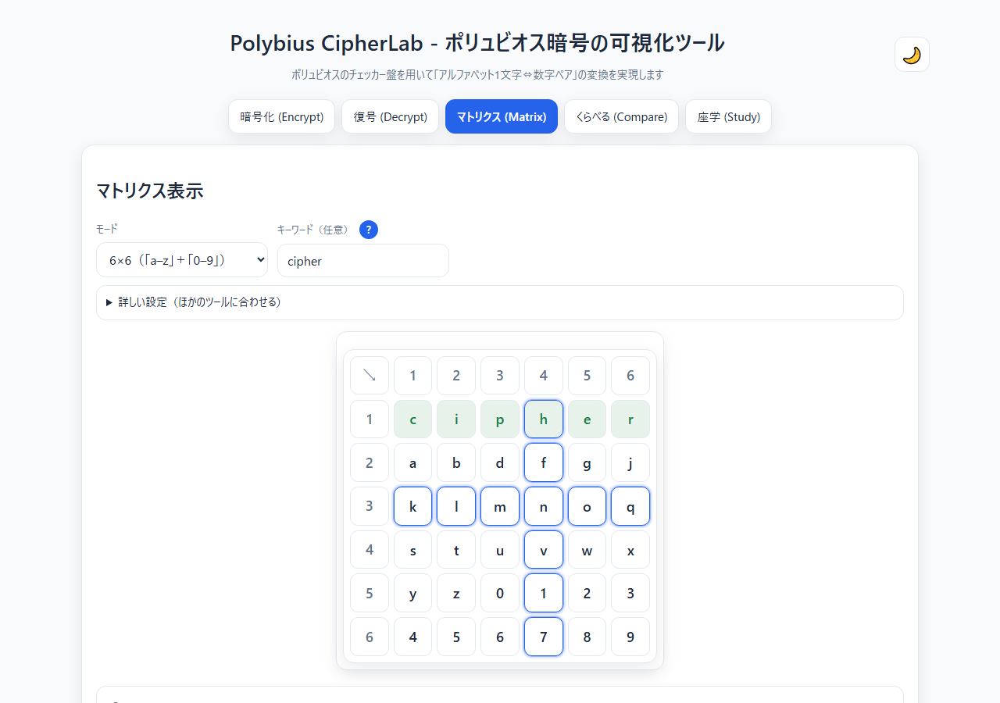
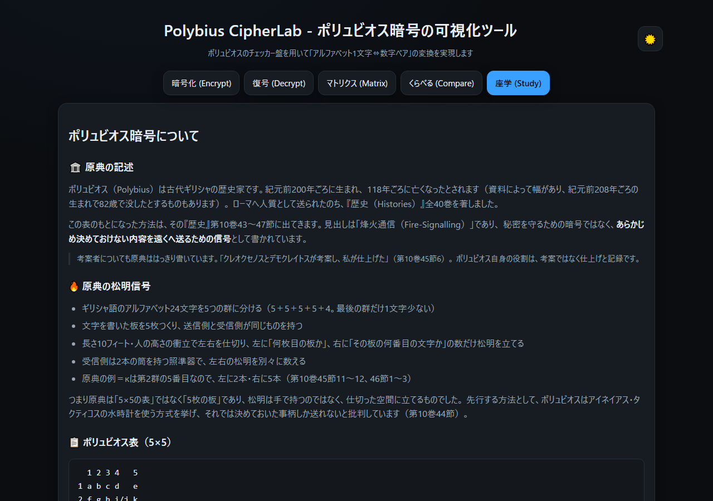
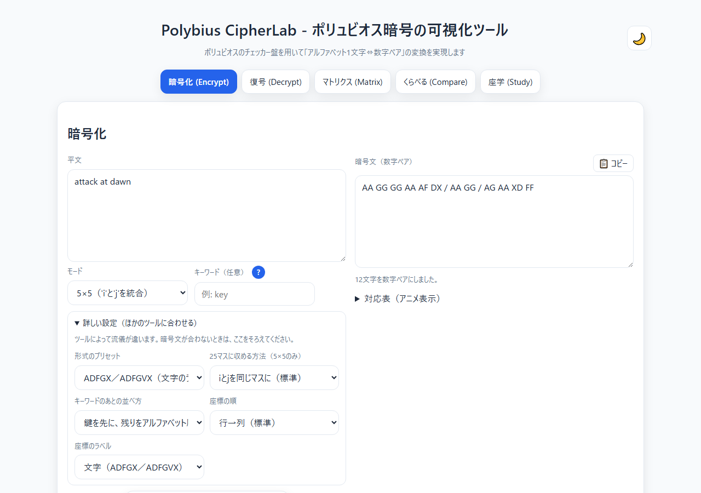
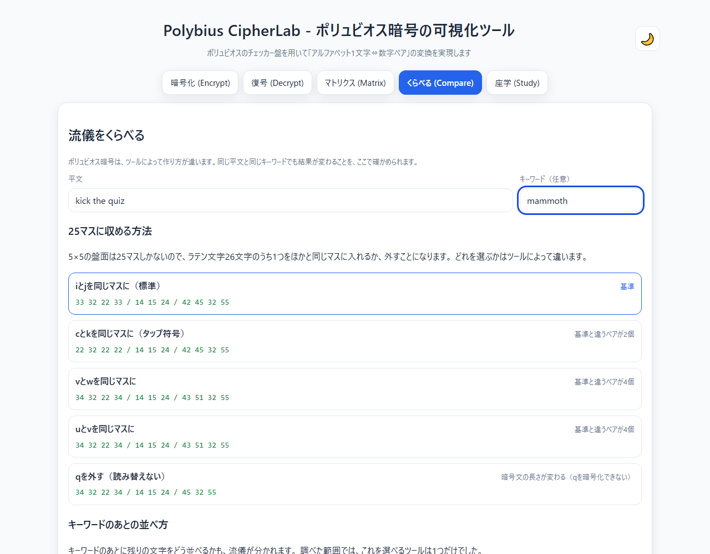

<!--
---
id: day067
slug: polybius-cipherlab

title: "Polybius CipherLab"

subtitle_ja: "ポリュビオス暗号ツール"
subtitle_en: "Polybius Cipher Visualization Tool"

description_ja: "古代ギリシャの烽火通信にさかのぼるポリュビオス暗号を学べるWebアプリ。文字を数字ペアに変換する方陣を可視化し、読み取れなかった入力も捨てずに表示します。"
description_en: "Visualize and practice the Polybius cipher. Build the square from a keyword, convert letters to number pairs, and see exactly which characters could not be read."

category_ja:
  - 古典暗号
  - 換字式暗号
category_en:
  - Classical Cryptography
  - Substitution Cipher

difficulty: 1

tags:
  - polybius
  - cipher
  - classical
  - cryptography
  - checkerboard
  - education
  - visualization

repo_url: "https://github.com/ipusiron/polybius-cipherlab"
demo_url: "https://ipusiron.github.io/polybius-cipherlab/"

hub: true
---
-->

# Polybius CipherLab - ポリュビオス暗号ツール


[](https://ipusiron.github.io/polybius-cipherlab/)

**Day067 - 生成AIで作るセキュリティツール100**

**Polybius CipherLab**は、ポリュビオス暗号（文字を数字ペアに置き換える古典暗号）を学ぶためのWebアプリです。

キーワードから方陣を組み立て、暗号化と復号の対応を1文字ずつ見られます。読み取れなかった入力を黙って捨てず、画面に残して件数を知らせます。

---

## 🌐 デモページ

👉 **[https://ipusiron.github.io/polybius-cipherlab/](https://ipusiron.github.io/polybius-cipherlab/)**

ブラウザーで直接お試しいただけます。

---

## 📸 スクリーンショット

>
>*キーワードkeyで"hello world"を暗号化したところ*

>
>*6×6モードの方陣。キーワードの文字を色分けして表示する*

>
>*復号で読み取れなかったものを残し、件数を知らせる*

>
>*座学タブ。原典の記述を出典つきで解説する（ダークモード）*

>
>*「詳しい設定」でADFGXの形式に合わせたところ。座標のラベルが文字になる*

>
>*くらべるタブ。同じ平文を5つの流儀で暗号化し、基準との違いを数える*

---

## ✨ 機能

- 暗号化：平文を方陣にしたがって数字ペアに変換する
- 復号：数字ペアの列を文字に戻す
- 方陣の可視化：モードとキーワードの変更に合わせて表を描き直し、キーワードの文字を色分けする
- セルのハイライト：方陣のセルを押すと、同じ行と列が光る
- 同期：暗号化タブの結果と設定を、復号タブへ1回の操作で移す
- 対応表：1文字ごとの変換を順に並べ、読み取れなかったものを色で分ける
- 2つのモード：5×5（iとjを同じマスに入れる）と6×6（a–zと0–9）
- ほかのツールに合わせる設定：25マスに収める方法、キーワードのあとの並べ方、座標のラベル、座標の順を選べる
- プリセット：dCode・cryptii と同じ既定、Crypto Corner（列→行）、ADFGX／ADFGVX、タップ符号（cとkを同じマスに）
- 読み替えの明示：復号で2通りに読める文字（iとjなど）を対応表に両方出し、件数を知らせる
- 流儀をくらべる：同じ平文を5つの流儀で暗号化して違いを並べ、キーワードのあとの並べ方5通りを方陣で見せる
- 座学：原典の記述と、方陣を部品に使う暗号を出典つきで解説する
- テーマ：ライトとダーク（初期値はブラウザーの設定にしたがう）

---

## 📖 使い方

1. 「暗号化」タブで平文を入力する
2. モード（5×5または6×6）を選ぶ
3. 必要ならキーワードを入れる（方陣の並びが変わる。復号する側も同じキーワードが要る）
4. 「暗号化する」を押す
5. 「同期」を押すと暗号文と設定が復号タブに移る。「復号する」で元に戻ることを確かめられる

### 3つのオプション

| オプション | オン | オフ |
|---|---|---|
| 単語の区切りを維持する | 空白・改行・タブを `/` にする | 空白・改行・タブを削除する |
| 数字ペアを連結する | `2315313134` のように続けて出す | `23 15 31 31 34` のように空白で区切る |
| 記号・数字をそのまま出力 | 方陣にない記号を暗号文に残す | 方陣にない記号を削除する |

### 詳しい設定（ほかのツールに合わせる）

ポリュビオス暗号は、ツールによって流儀が割れています。暗号文がほかのツールと合わないときは、「詳しい設定」を開いてそろえてください。

| 設定 | 選べるもの | 既定 |
|---|---|---|
| 25マスに収める方法 | iとj／cとk／vとw／uとv／qを外す | iとj |
| キーワードのあとの並べ方 | 鍵を先にアルファベット順／あとに出たほうを残す／鍵を逆順／残りを逆順／鍵を末尾 | 鍵を先にアルファベット順 |
| 座標のラベル | 数字（1〜5・1〜6）／文字（ADFGX・ADFGVX）／自分で決める | 数字 |
| 座標の順 | 行→列／列→行 | 行→列 |

プリセットを選ぶと、4つの設定がまとめて切り替わります。

- **このツールの既定**：dCode・cryptii・Boxentriq と同じ
- **Crypto Corner**：座標の順が列→行
- **ADFGX／ADFGVX**：座標のラベルが文字
- **タップ符号**：cとkを同じマスに入れる（ベトナム戦争の捕虜が使った流儀）

「同期」ボタンは、この設定も復号タブへ運びます。

「記号・数字をそのまま出力」をオンにすると、記号の前後には必ず空白が入ります。これがないと `a1b` が `11112` のようになり、どこからどこまでが1組かわからなくなります。英数字でない文字（日本語など）は、このオプションをオンにしても暗号文には出しません。

---

## 📐 画面構成

| タブ | 内容 |
|---|---|
| 暗号化 (Encrypt) | 平文の入力、モードとキーワード、3つのオプション、暗号文、対応表 |
| 復号 (Decrypt) | 暗号文の入力、同期ボタン、モードとキーワード、復号結果、対応表 |
| マトリクス (Matrix) | 方陣を大きく表示する。セルを押すと行と列が光る |
| くらべる (Compare) | 25マスに収める5つの流儀と、キーワードのあとの並べ方5通りを並べて見る |
| 座学 (Study) | 原典の記述、5×5の方陣、暗号としての性質、方陣を部品に使う暗号 |

3つのタブは**それぞれ独立した設定**を持ちます。暗号化タブのキーワードを変えても、復号タブの方陣は変わりません。設定を移したいときは「同期」ボタンを使います。

---

## 🎯 ユースケース

### セキュリティの学習

- 古典暗号の入口として、座標で文字を表す考え方を手を動かして確かめる
- 同じ文字がいつも同じペアになることを対応表で見て、単一換字式が頻度分析に弱い理由を理解する
- CTFや謎解きで数字だけの暗号文に出会ったとき、方陣で読めるかどうかを試す

### 教育・自習

- 情報の授業で、符号化（文字を数字で表すこと）の例として使う
- 歴史の授業で、古代ギリシャの通信手段として松明の信号を紹介する。原典が「5枚の板」であることまで踏み込める
- 数学の授業で、行と列の組で位置を指す考え方（座標）の具体例にする

### 仕事・実務

- 自分で書いた暗号化処理の出力と突き合わせて、実装の誤りを見つける
- ほかのツールと結果が合わないとき、「くらべる」タブで流儀の違いが原因かを切り分ける
- 研修やセキュリティ教育の教材として、1枚の画面で原理を説明する

### 趣味・創作

- 脱出ゲームや謎解きイベントの問題を作り、答えを検算する
- 小説やゲームに出す暗号の設定を、実際に動く形で確かめる
- 紙と鉛筆でできる遊びとして、子どもと暗号文をやりとりする
- 電子工作で、2つのLEDやブザーの合図の回数に文字を割り当てる（原典の松明の信号と同じ考え方）

### ほかのツールとの組み合わせ

- [Playfair CipherLab](https://ipusiron.github.io/playfair-cipherlab/)：同じ5×5の方陣を使う暗号と比べる
- [Uesugi Cipher Tool](https://ipusiron.github.io/uesugi-cipher/)：日本の7×7の方陣と比べる
- [Frequency Analyzer](https://ipusiron.github.io/frequency-analyzer/)：復号した平文の文字の出現頻度を調べる

### 限界

- 学習用のツールです。**秘密を守る目的には使えません。**単一換字式なので、文字の出現頻度から鍵なしでも解けます
- 5×5ではiとjを見分けられません。復号した結果は文意から補ってください
- 入力は10,000文字までです。超えた分は切り、その件数を知らせます

---

## 🔬 技術的な説明

### 方陣の作り方

1. キーワードから、方陣に入れられる文字だけを順に取り出す（5×5ではjをiに読み替え、数字と記号は除く）
2. 同じ文字が2回出てきたら、2回目以降を飛ばす
3. 残りのアルファベットを順に並べて、25マス（または36マス）を埋める
4. 行番号と列番号の組を、その位置の文字のペアとする

充填順を変えると、2〜3の並べ方が変わります。キーワード `key` の5×5（既定の設定）は次のようになります。

```
  1 2 3 4 5
1 k e y a b
2 c d f g h
3 i l m n o
4 p q r s t
5 u v w x z
```

### 復号の読み取り

空白・改行で区切り、`/` を単語の境界として扱い、数字の並びを2桁ずつ読みます。読み取れなかったものは、次のように**捨てずに残します**。

| 入力 | 扱い | 画面 |
|---|---|---|
| 方陣の範囲を超えるペア（5×5の `99` など） | `[ ]` で囲んで残す | 件数を知らせる |
| 2桁にならずに余った数字 | そのまま残す | 件数を知らせる |
| 数字でない文字 | そのまま残す | 件数を知らせる |

このため、記号を残した暗号文も元に戻ります。`a1b` → `11 1 12` → `a1b` のように往復します。

### 計算部の分離

方陣の生成・暗号化・復号は `js/polybius-core.js` にあり、DOMを使いません。画面側（`script.js`）は入力を読んで結果を表示するだけです。テストはこの計算部を直接呼びます。

---

## 🔒 セキュリティ

- すべてブラウザーの中で動きます。入力したテキストを外部へ送りません
- 外部のCDN・ライブラリー・アナリティクスを読み込みません
- CSP（Content Security Policy）を `<meta>` で指定しています（`default-src 'self'`）
- 画面への書き出しは `textContent` と要素の組み立てで行い、`innerHTML` を使いません
- `localStorage` に保存するのはテーマの選択だけで、入力したテキストは保存しません

---

## ⚠️ 注意

本ツールは学習・検証のためのものです。ここで作った暗号文で秘密を守ることはできません。秘密を守る必要がある場面では、現代の暗号（AES、公開鍵暗号など）を使ってください。

---

## ❓ FAQ

**Q. 5×5でjを入力すると、iになってしまいます。**

A. 5×5は25マスなので、ラテン文字26文字のうち1つをほかと同じマスに入れます。本ツールはiとjをまとめる流儀を採っています。jを別のマスに入れたい場合は6×6モードを使ってください。

**Q. ほかのツールと暗号文が一致しません。**

A. 流儀の違いが原因のことがあります。(1) 25マスに収める方法（iとj、cとk、vとw、qを落とす）、(2) 座標の順（行→列の順と、列→行の順）、(3) キーワードのあとの文字の並べ方、(4) 座標のラベル。**「詳しい設定」でこの4つを変えられます。**プリセットを選べば、Crypto Corner（列→行）やADFGX（文字のラベル）にまとめて合わせられます。

**Q. タップ符号を作れますか。**

A. プリセットの「タップ符号」を選ぶと、cとkを同じマスに入れる流儀になります。ベトナム戦争の捕虜が使った方式がこの形です（iとjをまとめる流儀ではありません）。壁を叩く回数が、そのまま行と列の数になります。

**Q. 復号したら `[99]` のような表示が出ました。**

A. 方陣の範囲を超える数字ペアです。モードやキーワードが暗号化時と違うか、暗号文が壊れている可能性があります。捨てずに残しているので、どこで食い違っているかを追えます。

**Q. 日本語は暗号化できますか。**

A. できません。方陣にはラテン文字（と6×6では数字）しか入らないため、日本語は削除して件数を知らせます。「記号・数字をそのまま出力」をオンにしても、日本語が暗号文に出ることはありません。

**Q. 6×6の数字の並びは決まっていますか。**

A. 本ツールは `a`〜`z` のあとに `0`〜`9` を行の順に詰めます。調べた範囲では、ほかのツールもこの並びで一致していました。

---

## 🔗 参考

### 原典・一次資料

- Polybius, *The Histories*, Book X, 43–47（松明による信号。考案者はクレオクセノスとデモクレイトスで、ポリュビオスは仕上げたと書いている）
- Aeneas Tacticus, *How to Survive under Siege*, XXXI（先行する水時計の方式）
- W. F. Friedman, *Military Cryptanalysis, Part I*（単一換字としての扱いと頻度分布）／*Part IV*（分置式の定義、ADFGX）
- P. Hitt, *Manual for the Solution of Military Ciphers*（1916）／A. Langie, *Cryptography*（1922）

### 関連するツール

- [Playfair CipherLab](https://ipusiron.github.io/playfair-cipherlab/)（Day027）
- [Uesugi Cipher Tool](https://ipusiron.github.io/uesugi-cipher/)（Day012）
- [Frequency Analyzer](https://ipusiron.github.io/frequency-analyzer/)（Day009）
- [Porta CipherLab](https://ipusiron.github.io/porta-cipherlab/)（Day080）

---

## 🧪 テスト

```bash
npm test
```

- Node.js 22以降で動きます。依存パッケージはありません（`node --test` だけを使います）
- GitHub Actionsで、pushとpull requestのたびに自動で実行します
- 計算部の往復・既知解答・境界・不正入力、index.htmlの静的な検査、配色のコントラスト比、READMEの表と例の照合を含みます
- このREADMEに載せた方陣と変換の例は、テストがコードで計算し直して一致を確かめています

---

## 📁 ディレクトリー構造

```
polybius-cipherlab/
├── index.html              # 画面（4つのタブ・ヘルプ・テーマの切り替え）
├── script.js               # 画面側の処理（入力の読み取り・表示・タブ・テーマ）
├── style.css               # 配色とレイアウト（ライト・ダーク、狭い画面への対応）
├── js/                     # スクリプト
│   ├── polybius-core.js    # 計算部（方陣の生成・暗号化・復号。DOMを使わない）
│   └── messages.js         # 画面に出す文言
├── test/                   # テスト（node --test で実行する）
│   ├── load.js             # 画面と同じスクリプトの読み込みと、照合用の参照実装
│   ├── core.test.js        # 計算部（往復・既知解答・境界・不正入力）
│   ├── options.test.js     # 設定（統合の流儀・充填順・座標のラベルと順）
│   ├── html.test.js        # index.html の静的な検査（CSP・id・aria・外部参照）
│   ├── contrast.test.js    # 配色のコントラスト比（ライト・ダークとも4.5:1以上）
│   ├── format.test.js      # 1行に詰め込んでいないか、計算部がDOMを使っていないか
│   └── readme.test.js      # README の表と例をコードで計算し直して照合する
├── .github/                # GitHub の設定
│   └── workflows/          # GitHub Actions のワークフロー
│       └── test.yml        # push と pull request で npm test を走らせる
├── assets/                 # 画像
│   ├── favicon.svg         # ブラウザーのタブに出すアイコン
│   ├── screenshot.png      # スクリーンショット（暗号化タブ）
│   ├── screenshot2.png     # スクリーンショット（マトリクスタブ）
│   ├── screenshot3.png     # スクリーンショット（復号タブ）
│   ├── screenshot4.png     # スクリーンショット（座学タブ・ダークモード）
│   ├── screenshot5.png     # スクリーンショット（詳しい設定・ADFGX）
│   └── screenshot6.png     # スクリーンショット（くらべるタブ）
├── package.json            # テストの実行設定（依存パッケージはない）
├── CLAUDE.md               # Claude Code 向けの案内
├── LICENSE                 # MITライセンス
├── .gitignore              # Git の除外設定
├── .nojekyll               # GitHub Pages で Jekyll を使わない指定
└── README.md               # このファイル
```

---

## 💻 動作環境

- モダンブラウザー（Chrome・Edge・Firefox・Safari の最新版）
- ローカルで開く場合は `index.html` をそのままブラウザーで開けます（読み込むファイルはすべて同じフォルダーの中にあります）
- テストを走らせる場合は Node.js 22以降が要ります

---

## 📄 ライセンス

MIT License – 詳細は [LICENSE](LICENSE) を参照してください。

---

## 🛠️ このツールについて

本ツールは、「生成AIで作るセキュリティツール100」プロジェクトの一環として開発されました。
このプロジェクトでは、AIの支援を活用しながら、セキュリティに関連するさまざまなツールを100日間にわたり制作・公開していく取り組みを行っています。

プロジェクトの詳細や他のツールについては、以下のページをご覧ください。

🔗 [https://akademeia.info/?page_id=42163](https://akademeia.info/?page_id=42163)
